# slime-dashboard

Stop watching the logs, watch slimes!

A pixel-art slime that lives in Claude Code's side pane. It crawls along while Claude works and naps while Claude waits, with your usage limits, context, subagents and recent events all around it, at a glance.

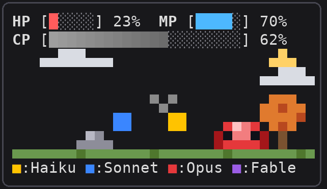

## Install

At a Claude Code prompt in a terminal:

```
/plugin install slime-dashboard --marketplace egan-wu/slime-dashboard
```

Answer `y` to add the marketplace, then pick a scope. The pane opens by itself when the terminal is 144 columns wide or more; in a narrower terminal, or after closing it, type `/slime-dashboard` to open it. It docks on the right only in Claude Code's fullscreen layout (`CLAUDE_CODE_NO_FLICKER=1`, 110 columns or more); otherwise it sits above the prompt.

To update later, press `[Update]` under [Setting](#setting).

## Session

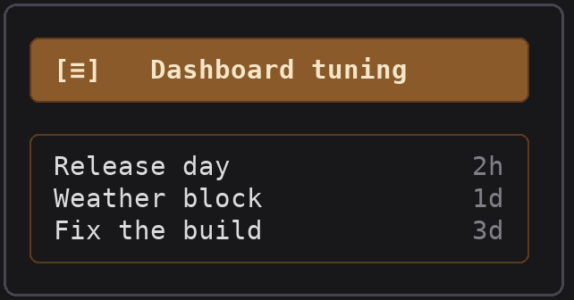

At the top, the session's name on a wooden sign: the one `/rename` gave it, else the one Claude Code made up. A new session with neither shows ` ! Mystic Journey ! `, the `!`s in red. It follows each prompt, so a rename typed at the prompt shows after the next one.

`[≡]` at the sign's left lists this project's recent sessions under it, newest first: each by its name (the `/rename` one, else Claude Code's, else when it was last used) with how long ago (`5m`, `3h`, `2d`). Pressing one resumes it (`/resume`); `[≡]` again closes the list. The session you are in, and any never typed into, are left out.

The sign is also a button. Pressed, it opens a field under it; type a new name and press Enter (or the sign again) to run `/rename` with it. A field left empty or unchanged closes without renaming, and `[x]` beside it closes it too. A rename is logged in Event Message as `Renamed: old → new`, so a wrong one can be undone by renaming back.

## HP / MP / CP, the slime and the model buttons


- **HP / MP / CP**: on a Pro or Max subscription HP is what is left of the seven-day limit and MP of the five-hour one; on an API key or enterprise seat HP stays full. CP (capacity) is how full the context window is, shading from light to dark grey.
- **The slime** travels while Claude works, past clouds, birds, trees (round green, pine or autumn orange, at random) and rocks at their own speeds; every load opens on the same stretch of road, where a tall oval tree stands half behind an autumn one. Along the road lie 2x2 blobs of goo in every color: it stretches taller with its white mouth wide open as it reaches each one and eats it, its context filling up. Its color follows the model: Fable purple, Opus red, Sonnet blue, Haiku yellow, unless Setting's `[Color]` picked others.
- **Its face**: walking with CP at 50% it squints (`> <`), at 70% a `#` shows beside its head, at 90% it is in tears (`T T`). Out of HP or MP it stops with `x` eyes until a limit resets and thinks of the potion it needs: a small dot rises beside its head, then a bigger one, then a thought bubble at its upper left holding blue mana for MP or red health for HP, and around again.
- **Unloading**: while the context compacts (`[Unload]`, `/compact`, or automatically) it wakes up if asleep and sets its load down until the compaction ends: every few beats its body flashes white and it spits the goo it ate back out of its back in a spray of colored blocks, and green `↓` arrows fall beside it.
- **Subagents**: each one buds off a little slime in its model's color that follows it. When the work is done the troop finds a treasure chest.
- **Weather**: by default the sky follows this computer's clock, day from 06:00 to 18:00, and each hour draws its weather at random: clear or partly cloudy most often, cloudy less, rain now and then, snow rarely. Nothing leaves the machine for it. Turning Setting's `[Weather]` to `[On]` reads the real weather where you are from [wttr.in](https://wttr.in) every hour instead, with day turning to night at sunset in between (wttr.in places you by your IP address, which is why it is off unless you choose it). Moon, stars and birds hide under an overcast sky.
- **Model buttons** `■:Haiku ■:Sonnet ■:Opus ■:Fable` switch the session's model (`/model haiku`, …): each family's newest model.

| Asleep | Waiting on you |
| --- | --- |
| 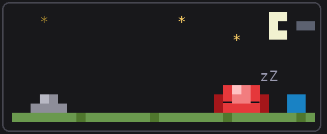 |  |
| Once the turn ends it falls asleep while the clouds and birds drift on. | A permission prompt or a question is open: the troop stops and a bubble with a bold `?` flashes over the slime until you answer. |

## Passive

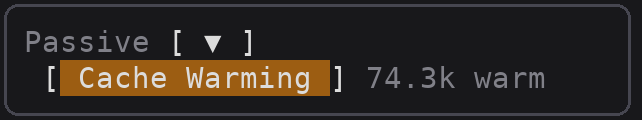

**Cache Warming** keeps the prompt cache alive while you are away. It is off until you turn it on, since its pings spend tokens of yours. Claude Code caches the conversation for a while after each request (an hour on a Pro or Max subscription, five minutes on an API key); come back after that and the whole context is written to the cache again, at 1.25× the input price for the five-minute cache or 2× for the hour one, where reading it costs 0.1×. While the session sits idle, Cache Warming sends a one-word request forked from the conversation a little before the cache would lapse: it reads the cache, which starts its time over, and nothing joins the conversation.

It sends only while that pays. Each ping reads the context at 0.1×; once the pings since your last prompt would cost more than coming back to a lapsed cache, it rests until your next prompt. A 74k context is kept about seven pings; one under about 28k (little beyond the system prompt and tools, which stay cached anyway) is not kept at all. It also rests when the cache has lapsed already, the model changes, a new session starts, or HP or MP runs out. Pings count toward your usage limits like any request.

| Button | What it does |
| --- | --- |
| `[ Cache Warming ]` | Off (the default) or on, kept across sessions: lit on an amber ground while on, dim while off. The dim word after it says what it is doing: `74.3k warm` (keeping that much), `resting` (not worth it now), `waiting` (for a prompt), or `off`. |

| Warming | Resting |
| --- | --- |
| 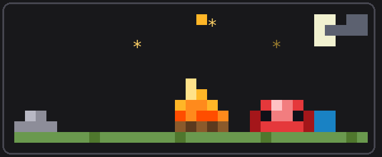 | 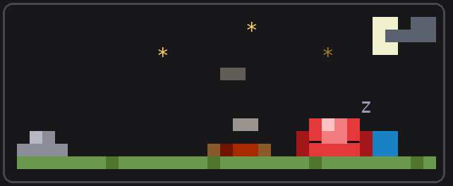 |
| When a turn ends and warming is keeping the cache, the slime spits a log, then a flame, and stays awake by the fire. | Once more pings would not pay, the fire burns down to embers and smoke, and the slime falls asleep beside them. |

## Property

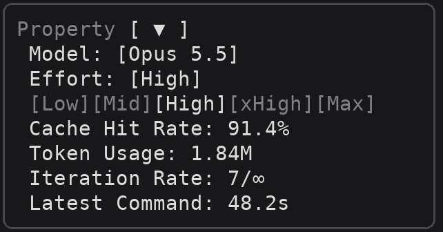

| Button | What it does |
| --- | --- |
| Model `[Opus 5.5]` | Opens a row `[Haiku][Sonnet][Opus][Fable]`, the current one bright; picking one runs `/model`. |
| Effort `[High]` | Opens the row of levels `[Low][Mid][High][xHigh][Max]`; picking one runs `/effort` with it and closes the row. |

Below them: the cache hit rate, the cache's time to live (`1h` or `5m`: `(env)` when `CLAUDE_CODE_PROMPT_CACHE_TTL` sets it, none when a settings file's `promptCacheTtl` does, `(auto)` otherwise), the tokens used, the iterations, and the latest turn's time.

## Skill Box

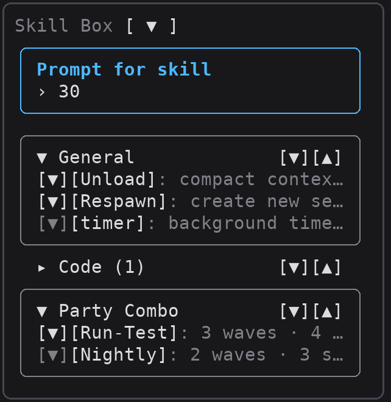

| Button | What it does |
| --- | --- |
| Prompt for skill | The field under the title, as wide as the pane so a long line wraps in full. Type, then Enter: the text becomes a piece in a frame of its own above the field, `▲ ▼` at its right moving it up or down, `x` taking it out, and `[Clear]` at the title's right taking them all out. After Enter the field keeps the keys for the next piece. Type as many pieces as you like; the next skill you press is sent with them all, in order (and anything still in the field), and they clear. |
| `▼ General` / `▸ Code (1)` | Opens or closes a category of skills; open, it is a rounded box with its skills inside, showing five rows at a time, `▲ ▼` scroll the rest. |
| `[▼]` `[▲]` (right of a category) | Moves the category a place down or up, kept across sessions. |
| `[▼]` (before a skill) | Trades places with the skill under it, kept across sessions. |
| **Party Combo** | The combos saved in the [Party Combo](#party-combo) section, each a button; pressed, it runs with the prompt as its input. |
| `[Unload]`, `[timer]`, … | Runs the skill: `/timer "30"` with the prompt, `/timer` alone without. `[Unload]` is built in and runs `/compact`. |
| `[Respawn]` | Built in: starts a new session (`/clear`), once confirmed. Pressed, its row asks `[Respawn]: [N]/[Y]`; `[N]` (grey under the pointer) backs out, `[Y]` (red under the pointer) clears. The old slime hops twice and leaps off to the right, turning half over; a great beam of light comes down in the middle of the scene, a ring of light runs out along the ground, glowing motes scatter, and a new slime takes shape in the beam, glints, pauses a second, then crawls to its place. |

Skills are added with `/slime-dashboard add` (see [Usage](#usage)).

## Party Combo

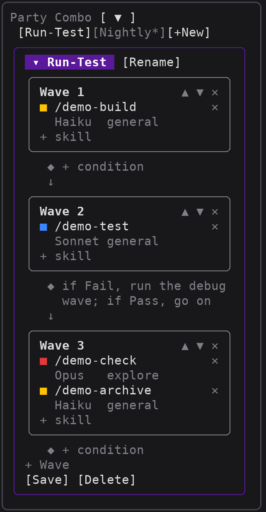

Party Combos: your Skill Box skills chained into waves, each skill run by a subagent with the model and subagent type you pick, and a leader subagent of its own (on Sonnet) leading the whole run in the background, so your conversation is never the one paying for it. The waves run in order; the skills of one wave all start at once, and the next wave waits for them all. For example, build, then unit-test, then check the result on Sonnet while Haiku archives the logs, at the same time.

| Button | What it does |
| --- | --- |
| `[Combo 1]` … `[+New]` | One tab per combo; `[+New]` starts one. A tab with `*` has unsaved edits. |
| `▾ Name` (the purple banner) | Folds the combo to its name, and opens it again. `[Rename]` beside it renames it. |
| `Wave 1` … `▲ ▼ ✕` | Each wave is a rounded box; `▲ ▼` move it, `✕` removes it. |
| `■ /skill  Haiku  general  ✕` | A skill in the wave, its swatch in its model's color. Press the model to cycle Haiku → Sonnet → Opus → Fable, the subagent type to cycle general → explore → plan (then your own agents from `.claude/agents/`), `✕` to take it out. In a narrow pane the model and type go on a second line. |
| `+ skill` | Lists the Skill Box's skills not yet in the wave, side by side; each press adds one. |
| `◆ + condition` | Between a wave and the next: what Claude should do with what came back, in your own words (`if Pass, report done; if Fail, run the debug wave`). Pressed, it opens a field. |
| `+ Wave` | Adds a wave at the end. |
| `[Save]` / `[Delete]` | Edits stay a draft, so trying things never breaks a combo that works, until `[Save]` (green under the pointer) keeps them; empty waves are dropped then. `[Delete]` (red under the pointer) asks `[Delete [Y]/[N]]`. |

A saved combo shows in the Skill Box under **Party Combo**. Explore and plan subagents only read, so a skill that writes files (a build, an archive) wants general.

## Dungeon

A tab of its own that opens when a Party Combo is pressed, and follows each press as a mission until its leader has led it to the end. Each press gets a number, `#1`, `#2`, …; its prompt and each step's tag carry it (`[Run-Test #3 2.1]`), so combos pressed close together, or one combo pressed twice, keep their subagents apart.

| What | Shows |
| --- | --- |
| The purple banner | The combo's name; the red `[x]` at its right takes the mission off the tab. |
| `#3 · 2026-10-09 15:21`  `● 124K` | The mission's number and when it was sent; at the right, after a gold coin that turns while the mission runs, the tokens the whole combo has used (its leader's and every subagent's requests: taken in, cache reads included, and given out). |
| `◆ Leader  leading [Recall]` | The subagent leading the mission, `leading` until the mission ends (between its turns as well), then its report of each step. The mission ends with it. `[Recall]` (red under the pointer) calls the whole mission back: the leader first, then every subagent it sent out that still runs (TaskStop, so Claude Code may ask your permission first). |
| `▸ Waves · 2 waves · 2/3 done · 1m 05s` | The waves, closed to how far their steps have got until pressed open (`▾`): how many are done, running, failed or stopped, `queued` before its leader starts, and once the mission ends how long it took (and `stopped` or `error` if so). |
| `Wave 1` … | The waves as they stood when pressed, with their conditions. Each step is a rounded card, closed to one line (its skill and how it stands) until `▸` opens it: then its model and subagent type, and how it stands (waiting, running with its model requests, last tool and time, done, failed, stopped, or not run when the combo ended before it) and its tokens, then the first lines of its answer. A running step's `[X]` (red under the pointer) calls that subagent back; its leader takes it as failed and does not run it again. |
| `Other subagents` | Subagents whose tag names no step: one a step's skill sent out itself, or one the leader added. |
| `[Clear All]` | Takes every mission off the tab. |

Where no subagent can be started, the press asks your conversation to lead the combo instead, as a prompt of its own. Missions are kept in this session's memory only. `/slime-dashboard dungeon` opens the tab.

## Party

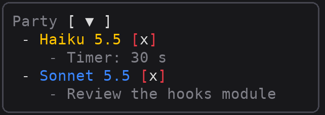

The subagents at work, each its model in its color and the few words its task was given. The red `[x]` beside one stops that subagent (TaskStop, so Claude Code may ask your permission first); its little slime drops out of line, and Event Message logs it as Stopped.

## Event Message

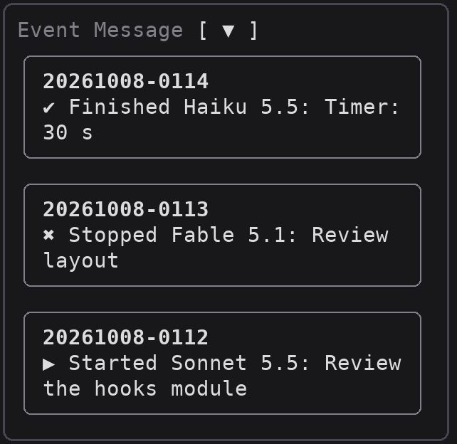

The newest three events, each framed, with this computer's local time (`YYYYMMDD-hhmm`) above a summary: a subagent started, finished or stopped, a question waiting or answered, out of HP/MP or back, the model or effort switched, a skill sent, the context compacted, a respawn, a rename, an update, and Cache Warming's doings (`♨ Cache warmed`, `rescued`, `cold`, `rests`). Twenty are kept.

## Journal

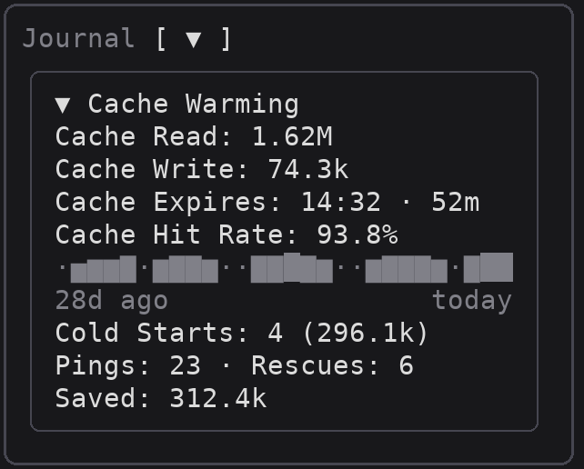

What the cache did, kept on this computer for thirty days across sessions. `▼ Cache Warming` opens or closes its block:

- **Cache Read / Write**: this session's tokens read from and written to the cache.
- **Cache Expires**: when the cache the last request left runs out, in this computer's time, and how long until then.
- **Cache Hit Rate** over the days, then a bar a day (as many as the box has room for, today last; `·` for a day with no record).
- **Cold Starts**: prompts that came back to a lapsed cache and wrote the context afresh, and how much.
- **Pings · Rescues**: the requests Cache Warming sent, and the prompts that found the cache still warm thanks to them.
- **Saved**: what rescues saved less what pings cost, in input tokens at full price.

## Setting

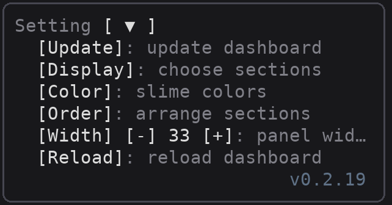

| Button | What it does |
| --- | --- |
| `[Update]` | Fetches the latest version from GitHub, updates the installed plugin, and reloads plugins in this session; how it went shows in a toast and in Event Message. A red `!` before it means GitHub has a newer version than the one running (checked each time the dashboard loads: at session start and at each reload). |
| `[Display]` | Opens a rounded box of checkboxes, one per section (Session, HP / MP / CP, Slime, Model buttons, Passive, Property, Skill Box, Party Combo, Party, Event Message, Journal); unticking one hides it, and the choice is kept across sessions. Pressed again, it closes the box. Setting always shows. |
| `[Color]` | Opens a rounded box with one row per model family; pressing a family's color button moves it to the next of six (Purple, Red, Blue, Yellow, Green, Pink). Families may share a color. The choice colors the slimes, the model buttons and Party, and is kept across sessions; `[Default]` puts the original four back. Pressed again, it closes the box. |
| `[Order]` | Opens a rounded box listing the sections top to bottom; each row's `[▲]` / `[▼]` moves that section a place up or down in the pane. A hidden section keeps its place (dim in the list). The order is kept across sessions; `[Default]` puts the original order back. Setting always stays last. Pressed again, it closes the box. |
| `[Width] [-] 33 [+]` | Makes the docked pane a column narrower or wider (24–80), kept across sessions. A width you dragged the dock to by hand wins over it. |
| `[Performance]` | How much the scene draws, kept across sessions. Pressed, a rounded box opens with `[High][Mid][Low]`, the current one bright; picking one closes it. High draws everything. Mid draws about 30% fewer things along the way (trees, rocks, goo, clouds, birds) and half of Unload's spray and Respawn's motes; Low about half the things and 30% of the spray and motes. |
| `[Weather] [Off]` | Off by default; pressed, it turns `[On]`, and pressed again back `[Off]`. On, the sky shows the real weather where you are, read from [wttr.in](https://wttr.in) every hour (it places you by your IP address); Off, day and night follow this computer's clock and the weather is drawn at random each hour. Kept across sessions. |
| `[Reload]` | Reloads the dashboard (`/reload-plugins`), as saving its files would. |

The plugin's version shows at the pane's foot.

## Getting around

Each section above can be hidden or moved with Setting's `[Display]` and `[Order]`. Every button also works from the keyboard: ctrl+x tab, or a click, gives the pane the keys, then Tab walks the buttons and Enter presses one. Each section's title button (`[ ▼ ]` while open, `[ ▲ ]` while closed) opens or closes it; closed, Party and Event Message count what they hold in their titles.

## Usage

```
/slime-dashboard                                   open the pane
/slime-dashboard add <skill> [--category <name>] [--desc <words>]
/slime-dashboard remove <skill>
/slime-dashboard list                              the Skill Box's skills, by category
/slime-dashboard weather                           read the sky now (wttr.in if Weather is On, else the clock), and say what came back
/slime-dashboard dungeon                           open Dungeon, the Party Combo missions of this session
```

Skills go in the Skill Box with `add`. Without `--category` a skill goes under **General**; `--desc` comes last and runs to the end of the line, drawn dim after the skill's name. Adding a skill again files it anew.

```
/slime-dashboard add timer --category General --desc background timer, prompt = seconds
/slime-dashboard add run-unit-test --category Test --desc run the unit tests
```

The skills you add, their order and your Party Combos are kept on this computer, shared by every project and session; windows open at once each see the others' changes when the Skill Box or the Party Combo section opens, and never write them away; another computer starts with General's `[Unload]` alone.

## Development

```
claude --plugin-dir ./slime-dashboard   # load from this folder; saves reload it
claude plugin validate ./slime-dashboard
claude plugin test ./slime-dashboard
python3 tools/pictures.py               # redraw docs/*.png (Node 22+, Pillow)
```

A release bumps the version in both `.claude-plugin/plugin.json` and `hooks/version.ts`.
