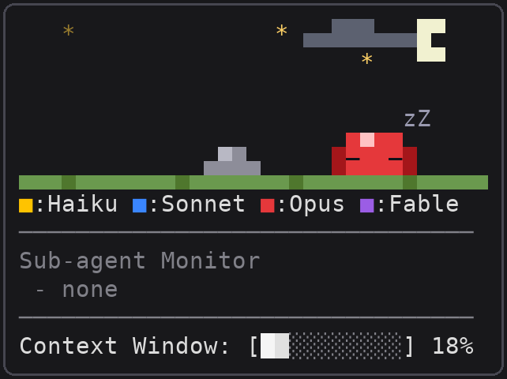
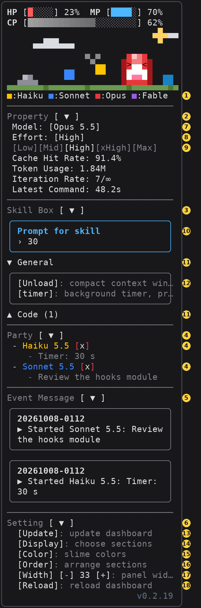
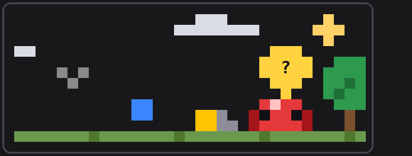

# slime-dashboard

A Claude Code side pane in the spirit of the offline dino game, starring a slime. It travels while Claude works and sleeps while Claude waits; each subagent is a little slime following it. Around the scene are your usage limits, the session's figures, a box of skills to run with one press, the subagents at work and what just happened.

| Idle, blocks closed | Busy, blocks open |
| --- | --- |
|  |  |



*Waiting on you: a permission prompt or a question is open, so the troop stops and a speech bubble with a bold `?` flashes over the slime until you answer.*

## Buttons

The numbers match the yellow badges in the pictures. Every button also works from the keyboard: ctrl+x tab, or a click, gives the pane the keys, then Tab walks the buttons and Enter presses one.

| # | Button | What it does |
| --- | --- | --- |
| 1 | `■:Haiku ■:Sonnet ■:Opus ■:Fable` | Switches the session's model (`/model haiku`, …): each family's newest model. |
| 2 | Property `[ ▲ ]` | Opens or closes the session's figures (7–9 below, then cache hit rate, tokens used, iterations, latest turn's time). |
| 3 | Skill Box `[ ▲ ]` | Opens or closes the skill box (10–12). |
| 4 | Sub-agent Monitor `[ ▼ ]` | Opens or closes the running subagents; closed, the title counts them. |
| 5 | Event Message `[ ▼ ]` | Opens or closes the newest three events; closed, the title counts them. |
| 6 | Setting `[ ▲ ]` | Opens or closes the settings (13–16). |
| 7 | Model `[Opus 5.5]` | Opens a row `[Haiku][Sonnet][Opus][Fable]`, the current one bright; picking one runs `/model`. |
| 8 | Effort `[High]` | Opens the row of levels (9). |
| 9 | `[Low][Mid][High][xHigh][Max]` | Picking a level runs `/effort` with it and closes the row. |
| 10 | Prompt for skill | Type here; the next skill you press is sent with it. Enter keeps the text, it does not send. |
| 11 | `▼ General` / `▲ Code (1)` | Opens or closes a category of skills; each shows five rows at a time, `▲ ▼` scroll the rest. |
| 12 | `[Unload]`, `[timer]`, … | Runs the skill: `/timer "30"` with the prompt, `/timer` alone without. `[Unload]` is built in and runs `/compact`. |
| 13 | `[Update]` | Fetches the latest version from GitHub, updates the installed plugin, and reloads plugins in this session; how it went shows in a toast and in Event Message. A red `!` before it means GitHub has a newer version than the one running (checked at start and every 30 minutes). |
| 14 | `[Display]` | Opens a rounded box of checkboxes, one per section (HP / MP / CP, Slime, Model buttons, Property, Skill Box, Sub-agent Monitor, Event Message); unticking one hides it, and the choice is kept across sessions. Pressed again, it closes the box. Setting always shows. |
| 15 | `[Color]` | Opens a rounded box with one row per model family; pressing a family's color button moves it to the next of six (Purple, Red, Blue, Yellow, Green, Pink). Families may share a color. The choice colors the slimes, the model buttons and the monitor, and is kept across sessions; `[Default]` puts the original four back. Pressed again, it closes the box. |
| 16 | `[Reload]` | Reloads the dashboard (`/reload-plugins`), as saving its files would. |

## What it shows

- **HP / MP / CP**: on a Pro or Max subscription HP is what is left of the seven-day limit and MP of the five-hour one; on an API key or enterprise seat HP stays full. CP (capacity) is how full the context window is, shading from light to dark grey.
- **The slime**: it travels while Claude works, past clouds, birds, trees and rocks at their own speeds; once the turn ends it falls asleep while the clouds and birds drift on. Its color follows the model: Fable purple, Opus red, Sonnet blue, Haiku yellow, unless Setting's `[Color]` picked others.
- **Its face**: out of HP or MP it stops with `x` eyes until a limit resets, and a flashing ring at its upper left holds the potion it needs: blue mana for MP, red health for HP. While the context compacts (`[Unload]`, `/compact`, or automatically) it wakes up if asleep, and a flashing ring at the same place shows a sack with a green arrow pointing down until the compaction ends. Walking with CP at 50% it squints (`> <`), at 70% a `#` shows beside its head, at 90% it is in tears (`T T`).
- **Subagents**: each one buds off a little slime in its model's color. When the work is done the troop finds a treasure chest.
- **Weather**: the sky follows day or night and the weather where you are, read from [wttr.in](https://wttr.in) every 15 minutes (wttr.in places you by your IP address). Moon, stars and birds hide under an overcast sky.
- **Event Message**: the newest three events, each framed, with this computer's local time (`YYYYMMDD-hhmm`) above a summary: a subagent started or finished, a question waiting or answered, out of HP/MP or back, the model or effort switched, a skill sent, the context compacted, an update.
- **Version**: the plugin's version, at the pane's foot.

## Install

At a Claude Code prompt in a terminal:

```
/plugin install slime-dashboard --marketplace egan-wu/slime-dashboard
```

Answer `y` to add the marketplace, then pick a scope. The pane opens by itself when the terminal is 144 columns wide or more; in a narrower terminal, or after closing it, type `/slime-dashboard` to open it. It docks on the right only in Claude Code's fullscreen layout (`CLAUDE_CODE_NO_FLICKER=1`, 110 columns or more); otherwise it sits above the prompt.

To update later, press `[Update]` under Setting (13).

## Usage

```
/slime-dashboard                                   open the pane
/slime-dashboard add <skill> [--category <name>] [--desc <words>]
/slime-dashboard remove <skill>
/slime-dashboard list                              the Skill Box's skills, by category
/slime-dashboard weather                           read the sky now, and say what came back
```

Skills go in the Skill Box with `add`. Without `--category` a skill goes under **General**; `--desc` comes last and runs to the end of the line, drawn dim after the skill's name. Adding a skill again files it anew.

```
/slime-dashboard add timer --category General --desc background timer, prompt = seconds
/slime-dashboard add run-unit-test --category Test --desc run the unit tests
```

The skills you add are kept on this computer, across sessions; another computer starts with General's `[Unload]` alone.

## Development

```
claude --plugin-dir ./slime-dashboard   # load from this folder; saves reload it
claude plugin validate ./slime-dashboard
claude plugin test ./slime-dashboard
python3 tools/pictures.py               # redraw docs/*.png (Node 22+, Pillow)
```

A release bumps the version in both `.claude-plugin/plugin.json` and `hooks/version.ts`.
